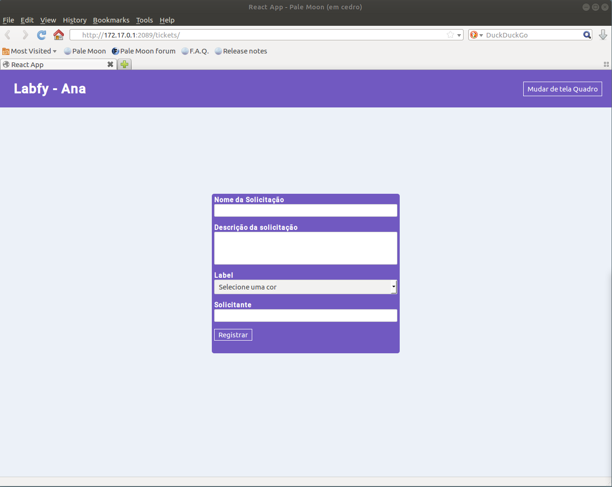
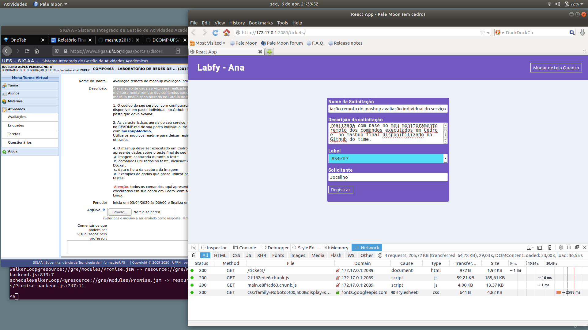
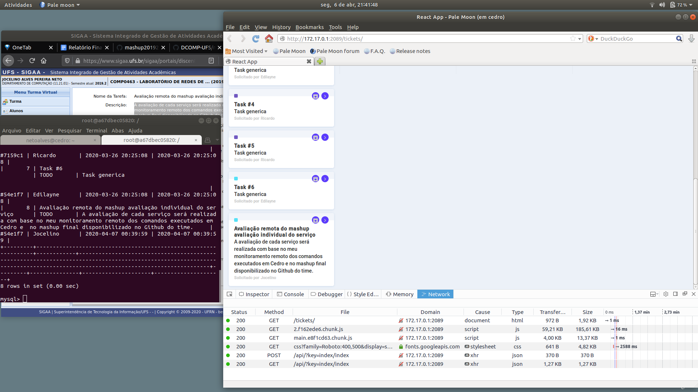
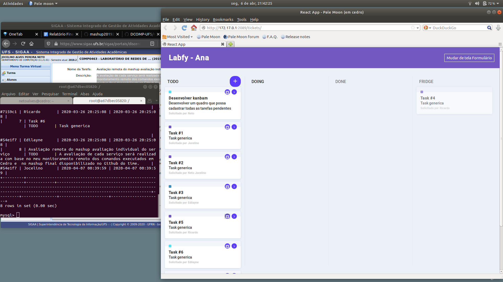
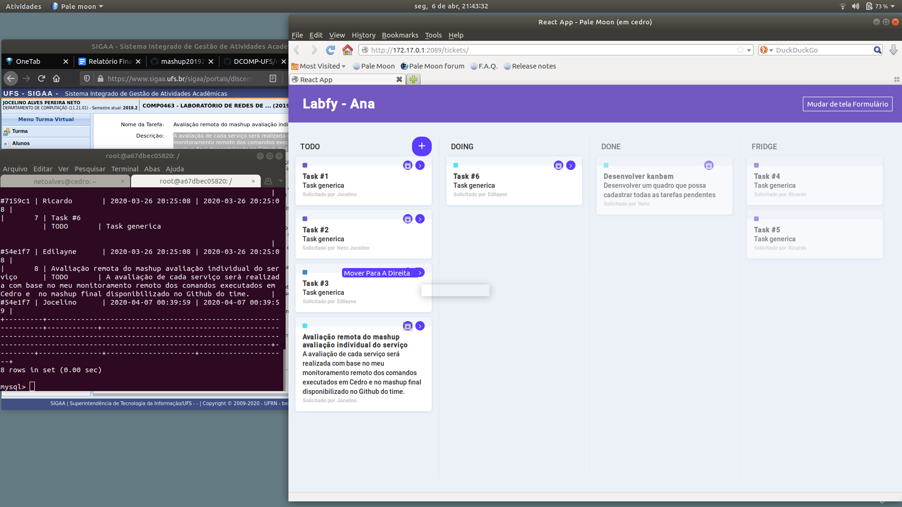

# Labfy - Tickets
-----------------


> Este repositório é a aplicação frontend `Labfy`, desenvolvida com base na aparência do [Pipefy](https://www.pipefy.com/)
> seguindo o tutorial do vídeo [Recriando Pipefy do zero (com drag n' drop)](https://www.youtube.com/watch?v=awRtgpRsdTQ).


## Visão geral
--------------

Aplicação para listar cards que aguardam ser atendidas, seguindo o fluxo de **Para fazer**, **Fazendo**, **Feito** ou **Congelado**.


## Pré-requisitos
-----------------
- NodeJS
- Yarn ou NPM


## Instalação
-------------
Uma vez que você tem tudo instalado pode seguir os passos abaixo para executar e rodar o projeto:
 - Clone esse repositório com
 
 ```$ git clone https://github.com/netojocelino/labfy-frontend.git```;
 - Entre na pasta: `cd labfy-frontend`;
 - Instalar todas as dependências:
   - Em caso de Yarn executar `yarn`;
   - Executar `npm install` ou `npm i` em caso de estar utilizando npm;


## Executar teste
-----------------

Após já ter instalado os pré-requisitos, basta seguir abaixo dentro da pasta do projeto
- Rodar o projeto:
  - Em caso de Yarn executar `yarn start`;
  - Executar `npm start` caso utilize npm.

Para ver o projeto rodando, você pode abrir `localhost:3000` no seu navegador.


## Produto para entrega
-----------------------

Após já ter instalado os pré-requisitos, basta seguir abaixo dentro da pasta do projeto
- *Entregar* projeto:
  - `yarn build` em caso de utilizar yarn.
  - `npm run build` em caso de npm.


## Caso de teste
A tela inicial da aplicação pode ser vista em `/tickets/`



Uitlizando como Nome de solicitação ***Avaliação remota do mashup avaliação individual do serviço***, como descrição ***A avaliação de cada serviço será realizada com base no meu monitoramento remoto dos comandos executados em Cedro e  no mashup final disponibilizado no Github do time.***, como label ***#54E1F7*** e como solicitante ***Jocelino*** teremos o registro que pode ser visto a seguir



E como resultado




Seguindo o fluxo comentado na visão geral de arquivar podemos chegar na tela a seguir



E após alguns movimentos podemos chegar em 




## Licença

MIT &copy; [Neto Jocelino](https://github.com/netojocelino/)
